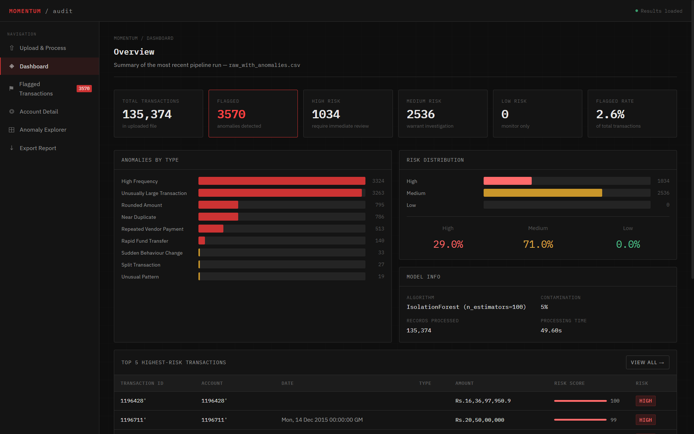
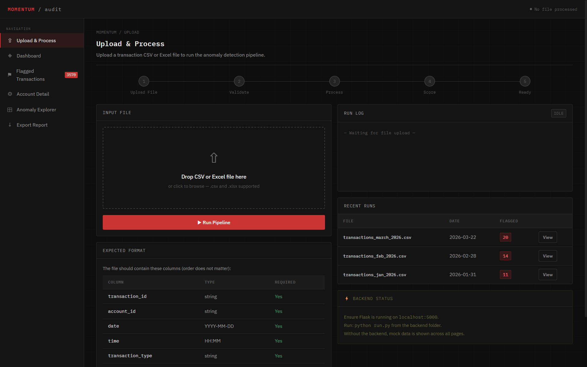
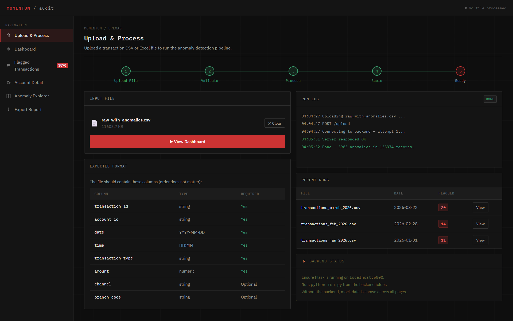
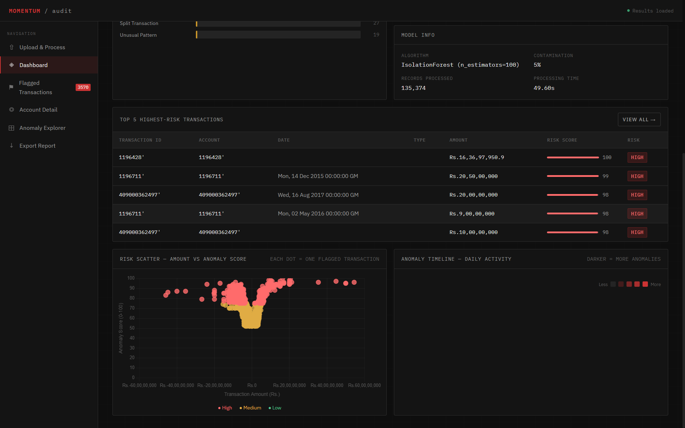
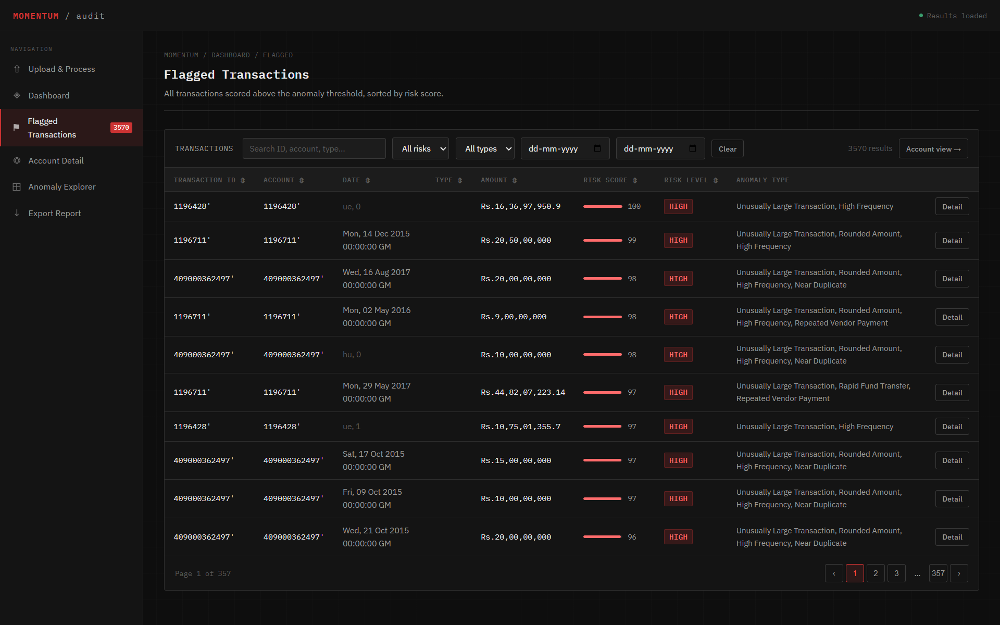
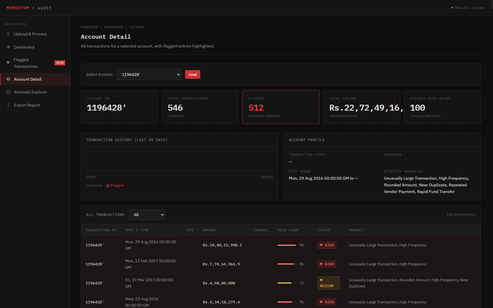
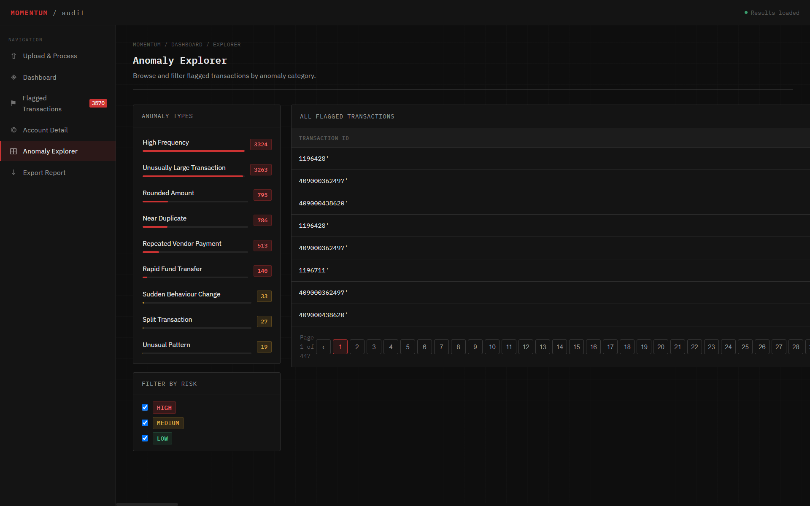
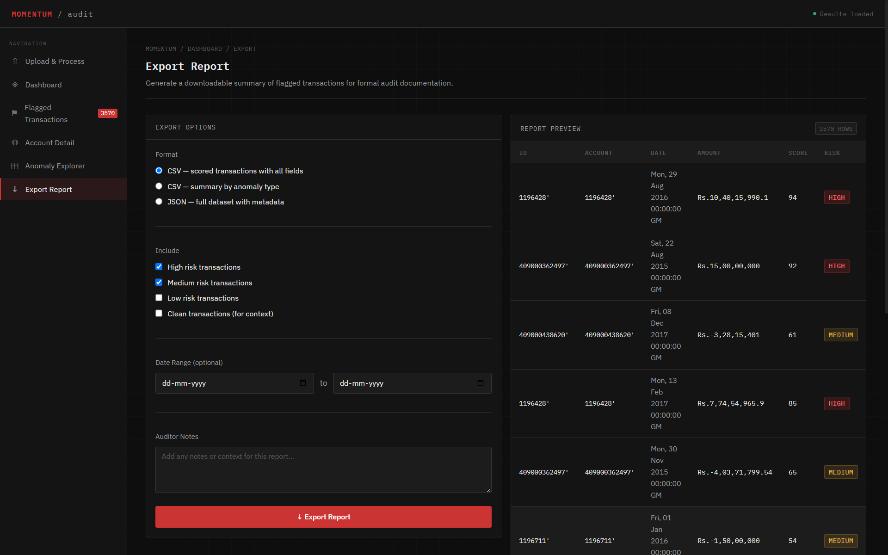

# Momentum — Bank Anomaly Detection



> An auditor-focused anomaly detection system for co-operative bank transaction records, powered by unsupervised machine learning.


---

## Problem Statement

Co-operative banks in Kerala serve as financial lifelines for millions of people — yet many still rely entirely on periodic manual audits to detect fraud. This process is slow, inconsistent, and easily circumvented. High-profile cases like the **Karuvannur Service Co-operative Bank scam (2021)**, involving over ₹100 crore in irregularities, illustrate the cost of this gap.

Momentum addresses this by automating the detection of anomalous transactions in uploaded bank records. Auditors upload a CSV file, the system runs the data through an ML pipeline, and a structured dashboard presents flagged transactions ranked by risk — letting reviewers focus on what matters.

---

## Features

- Upload any bank transaction CSV and get results in under a minute
- Anomaly detection using **Isolation Forest** (no labeled fraud data required)
- Automatic **risk scoring** per transaction: High / Medium / Low
- **8 anomaly type labels** assigned to flagged transactions:
  - Unusually Large Transaction
  - Rounded Amount
  - Split Transaction
  - High Frequency
  - Rapid Fund Transfer
  - Dormant Account Activity
  - Near Duplicate / Repeated Vendor Payment
  - Sudden Behaviour Change
- **6-page auditor dashboard**: Upload, Overview, Flagged Transactions, Account Detail, Anomaly Explorer, Export
- **Risk scatter plot** (amount vs anomaly score) and **timeline heatmap** (daily anomaly calendar)
- Export flagged transactions as CSV or JSON for formal audit documentation
- Handles inconsistent CSV column naming across different bank formats

---

## Tech Stack

| Layer | Technology |
|---|---|
| Backend | Python 3.9+, Flask |
| ML Model | scikit-learn (Isolation Forest) |
| Data Processing | pandas, NumPy |
| Frontend | HTML, CSS, JavaScript (Vanilla) |
| Charts | Chart.js |
| File I/O | openpyxl, joblib |
| Storage | Browser localStorage (no database) |

---

## System Architecture

```
Browser (localhost:5000)
        │
        │  HTTP — same origin, no CORS
        ▼
┌──────────────────────────────────┐
│         Flask (run.py)           │
│                                  │
│  GET  /          → index.html    │
│  GET  /<file>    → static files  │
│  POST /upload    → ML pipeline   │
└───────────────┬──────────────────┘
                │
        services/ pipeline
                │
   ┌────────────▼────────────┐
   │  1. preprocess.py        │  Clean data, normalize columns
   │  2. feature_engineering  │  Extract 7 numeric features
   │  3. model.py             │  Train IsolationForest (fresh each run)
   │  4. anomaly_detector.py  │  Score, classify, label anomalies
   │  5. routes.py            │  Format JSON response
   └─────────────────────────┘
                │
                │  JSON → localStorage → All pages
                ▼
        Frontend Dashboard
```

Flask serves the frontend as static files, so **one command starts everything**.

---

## Folder Structure

```
momentum/
└── backend/
    ├── run.py                  # Entry point — starts Flask and opens browser
    ├── config.py               # Path constants (upload, output, model dirs)
    ├── requirements.txt
    ├── static/                 # Frontend (served by Flask)
    │   ├── index.html          # Upload page
    │   ├── dashboard.html      # Overview & charts
    │   ├── flagged.html        # All flagged transactions
    │   ├── account.html        # Per-account deep dive
    │   ├── explorer.html       # Browse by anomaly type
    │   ├── export.html         # Export reports
    │   ├── data.js             # Shared data layer & backend integration
    │   └── style.css           # Global dark theme styles
    ├── models/
    │   └── isolation_forest.pkl
    ├── uploads/                # Incoming CSVs (auto-created)
    ├── outputs/                # Scored CSVs (auto-created)
    └── app/
        ├── routes.py           # /upload endpoint — orchestrates pipeline
        └── services/
            ├── preprocess.py           # Data cleaning
            ├── feature_engineering.py  # Feature extraction
            ├── anomaly_detector.py     # Scoring + labeling
            └── model.py               # IsolationForest training
```

---

## How It Works

**Step 1 — Upload**
User uploads a transaction CSV (or Excel) via the web interface. The system accepts files with any column naming convention — it searches for keywords like `account`, `withdrawal`, `deposit`, `balance`, `date` to map columns automatically.

**Step 2 — Preprocess**
Raw data is cleaned: commas removed from numeric fields, missing values filled, column names normalized. Bad rows are skipped silently.

**Step 3 — Feature Engineering**
Seven numeric features are extracted for the model:
`Withdrawal Amount`, `Deposit Amount`, `Balance`, `Net Amount` (deposit − withdrawal), `Day`, `Month`, `Hour`

These capture both financial magnitude and temporal behavior patterns.

**Step 4 — Model Training**
An IsolationForest is trained on the uploaded data (sampling up to 3000 rows for speed). The model assigns an anomaly score to every transaction — higher score means more anomalous. Transactions flagged by the model (`contamination=0.03`, meaning ~3% expected anomalies) receive a binary flag.

**Step 5 — Labeling & Risk Assignment**
Flagged transactions are passed through 8 domain-specific rules that assign human-readable anomaly type labels. Risk level is then assigned by score threshold:

| Score | Risk |
|---|---|
| > 0.75 | 🔴 High |
| 0.50 – 0.75 | 🟡 Medium |
| < 0.50 | 🟢 Low |

**Step 6 — Dashboard**
Results are returned as JSON and stored in the browser. All 6 pages read from this shared state — no page reload or re-upload needed.

---

## Installation & Setup

### Prerequisites

- Python 3.9 or higher
- pip

### Install dependencies

```bash
cd momentum/backend
pip install -r requirements.txt
```

### Run

```bash
python run.py
```

Your browser will open automatically at `http://localhost:5000`.

> **Note:** The system trains a fresh model on every upload. This typically takes 10–30 seconds depending on file size and machine speed.

---

## API

The system exposes a single endpoint:

### `POST /upload`

Accepts a multipart form with a `.csv` or `.xlsx` file. Returns JSON.

**Request:**
```
Content-Type: multipart/form-data
Body: file=<transaction_file.csv>
```

**Response:**
```json
{
  "fraud_count": 45,
  "total_records": 5000,
  "processing_ms": 14200,
  "data": [
    {
      "transaction_id": "TXN-001",
      "account_id": "ACC-1234",
      "date": "2024-01-15",
      "amount": 50000,
      "score": 0.87,
      "Anomaly": 1,
      "Risk": "High Risk",
      "anomaly_type": "Rounded Amount, High Frequency"
    }
  ]
}
```

---

## Expected CSV Format

The system attempts to auto-detect column names, but the following structure gives the best results:

| Column | Type | Required |
|---|---|---|
| `transaction_id` | string | Yes |
| `account_id` | string | Yes |
| `date` | YYYY-MM-DD | Yes |
| `time` | HH:MM | Optional |
| `transaction_type` | string | Optional |
| `withdrawal_amt` | numeric | Yes |
| `deposit_amt` | numeric | Yes |
| `balance_amt` | numeric | Yes |

Column names are case-insensitive and flexible — `Account No`, `ACCT_ID`, `Withdrawal Amt` are all recognized.

---

## Screenshots

### Upload Page

| Before Upload | After Upload |
|--------------|--------------|
|  |  |

Upload transaction files and monitor processing progress.

---

### Dashboard Overview

| Overview Metrics | Analytics & Risk Distribution |
|-----------------|-------------------------------|
|  |  |

The dashboard provides high-level insights into anomalies, risk levels, transaction trends, and model outputs.

---

### Flagged Transactions



Review all suspicious transactions with sorting and filtering capabilities.

---

### Account Detail View



Investigate account-level transaction history and anomaly behavior.

---

### Anomaly Explorer



Browse transactions grouped by anomaly type and analyze suspicious patterns.

---

### Export Reports



Export flagged transactions as CSV or JSON for audit documentation and reporting.

---

## Challenges Faced

**Inconsistent bank CSV formats**
Different banks use different column names for the same field. We resolved this by building a keyword-search-based column resolver that handles 10+ naming variants per field.

**Feature compatibility after model updates**
scikit-learn requires that prediction features exactly match training features. When we added new temporal features (Day, Month, Hour), the saved model became incompatible. We addressed this by always training fresh on the uploaded data.

**Processing time on large files**
Initial labeling logic iterated row-by-row, which was unacceptably slow on large datasets. Replacing this with vectorised pandas operations brought processing time down significantly.

**Browser-based state without a database**
Since the system runs locally without a database, we used browser localStorage to persist results across the 6 dashboard pages.

---

## Limitations

- **No ground truth validation**: The model flags statistical outliers, not confirmed fraud. Results should always be reviewed by a human auditor.
- **No authentication**: The system is designed for single-user local use. It should not be exposed to a network without adding access controls.
- **localStorage limit**: Browser storage caps around 5–10MB. Very large result sets may not persist correctly.
- **Single currency assumption**: The model is trained on INR-denominated data. Mixed-currency files will produce unreliable scores.
- **Unsupervised model**: With no labeled examples of fraud, the model cannot report precision or recall.

---

## Future Improvements

- **Auditor feedback loop**: Let auditors mark transactions as confirmed fraud or false positive, feeding back into model retraining
- **SHAP explainability**: Show which features drove each anomaly score, making results interpretable for non-technical reviewers
- **Labeled data pipeline**: When labeled fraud data becomes available, switch to a supervised classifier (Random Forest, XGBoost) with proper cross-validation
- **Federated learning**: Train a shared model across multiple co-operative banks without sharing raw transaction data
- **User authentication and HTTPS**: Required before any network deployment
- **Database backend**: Replace localStorage with PostgreSQL or SQLite for multi-user support and persistent audit history

---

## Team

| Name | Role |
|---|---|
| Adwaith Shameer | Team Lead & Frontend Development — UI/UX design, implementation of all 6 dashboard pages, chart visualizations, CSS theme development, and team coordination |
| Christeena Geejo | Backend & Machine Learning — data preprocessing, feature engineering, Isolation Forest implementation, anomaly detection pipeline, and model development |
| Adwaith Aswakumar | Integration & Deployment — pipeline orchestration, frontend-backend communication, error handling, performance optimization, testing, and deployment support |

---

## References

- Liu, F. T., Ting, K. M., & Zhou, Z.-H. (2008). *Isolation Forest*. IEEE ICDM.
- Liu, F. T., et al. (2012). *Isolation-Based Anomaly Detection*. ACM TKDD.
- Zhioua, S. (2019). *Unsupervised Anomaly Detection in Financial Transactions Using Isolation Forest*.
- RBI Report on Co-operative Banks, 2022.
- [Karuvannur Co-operative Bank Scam — Deccan Chronicle](https://www.deccanchronicle.com/southern-states/kerala/what-is-karuvannur-scam-that-created-ripples-in-kerala-politics-1882105)

---

## License

This project is released under the MIT License. See `LICENSE` for details.

---

*Built as a mini project for the Department of Computer Science, 2025–26.*
